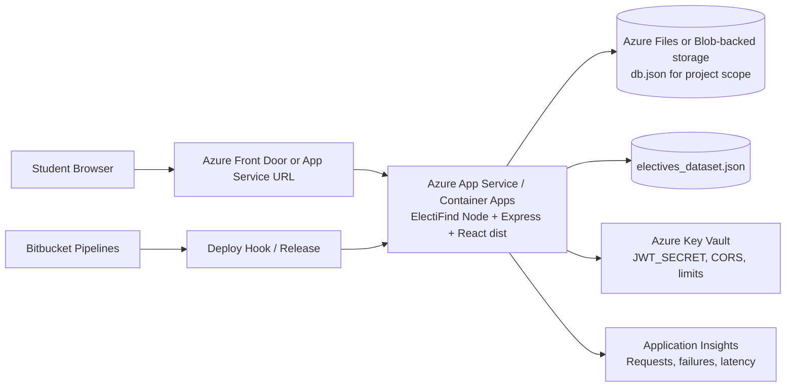
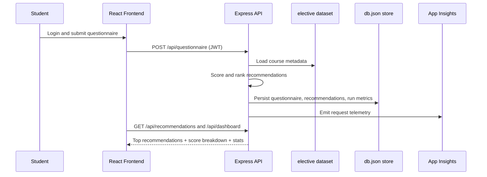

# Review 2 Cloud Mapping (Concrete Azure Resources)

This maps ElectiFind to concrete hyperscaler services for review presentation.

## Resource Mapping (Azure)
- Frontend + API hosting: Azure App Service (Linux, Node 20) or Azure Container Apps
- Container registry: Azure Container Registry (if using Docker deployment)
- Persistent data file for current scope: Azure Files mount or Azure Blob Storage mounted via App Service/Container volume
- Secrets and config: Azure Key Vault + App Service environment settings
- Monitoring: Azure Application Insights + Log Analytics
- CI/CD: Bitbucket Pipelines triggering deploy webhook or Azure DevOps/GitHub Actions

## Architecture Diagram

## Request/Processing Flow

## Why this is acceptable for Review 2
- Shows concrete hyperscaler services, not generic cloud terms.
- Shows how CI/CD connects to deployment.
- Includes observability and secret management.
- Keeps current project data model while describing upgrade path.

## Upgrade Path (Post-Review)
- Replace db.json with Azure Database for PostgreSQL.
- Store recommendation telemetry in Azure Monitor custom events.
- Add Azure API Management in front of API for policies and throttling.
